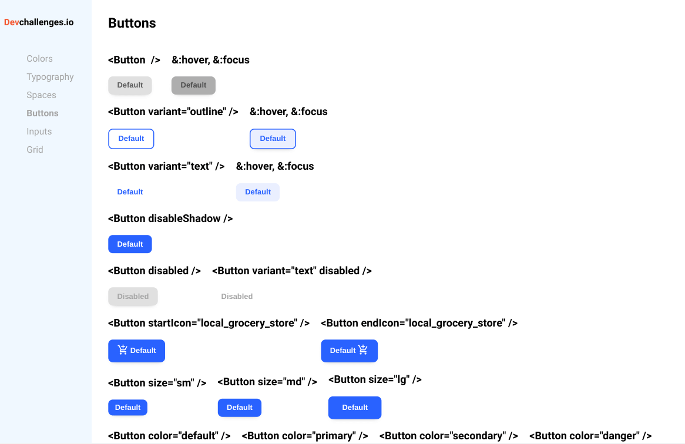
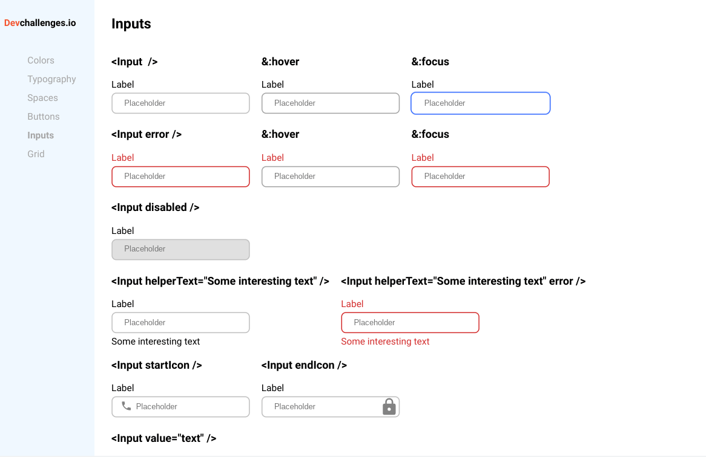

<h1 align="center">DevChallenges - Button / Input Components Challenge</h1>

   Solution for a challenge from  <a href="http://devchallenges.io" target="_blank">Devchallenges.io</a>.

  <h3>
    <a href="https://jdegand.github.io/devchallenges-storybook">
      Live App
    </a>
     | 
         <a href="https://jdegand.github.io/storybook-gh-pages/?path=/story/devchallenges-button--danger">
      Live Storybook
    </a>
     | 
    <a href="https://devchallenges.io/challenges/ohgVTyJCbm5OZyTB2gNY">
      Button Challenge
    </a>
     | 
    <a href="https://devchallenges.io/challenges/TSqutYM4c5WtluM7QzGp">
      Input Challenge
    </a>
  </h3>

## Table of Contents

- [Overview](#overview)
  - [Built With](#built-with)
- [Features](#features)
- [Thoughts](#thoughts)
- [Useful Resources](#useful-resources)

## Overview

 

### Built With

- [React](https://reactjs.org/)
- [Storybook](https://storybook.js.org/)
- [Styled Components](https://styled-components.com/)
- [Material Icons](https://materialdesignicons.com/)

## Features

This application/site was created as a submission to a [DevChallenges](https://devchallenges.io/challenges) challenge. The [challenge](https://devchallenges.io/challenges/ohgVTyJCbm5OZyTB2gNY) was to build an application to complete the given user stories.  The [challenge](https://devchallenges.io/challenges/TSqutYM4c5WtluM7QzGp) was to build an application to complete the given user stories.

## Thoughts 

- Storybook requires a lot more prep than you would think.  Having so many properties, I thought styled components offered the best solution.
- Adding classnames / using classnames package - would have been an alternative solution.  

- Wanted to do both challenges in one repo so I didn't have to re-download cra and dependencies again. 

- Should I prevent startIcon and endIcon from both being set ?

- Offering multiple image choices seems like a headache - having to import them etc - vs using a image from a cdn where you would just need a url. 

- Adding "or null" to the value prop allows you to type into the inputs - without setting up state and controlling the value prop and adding onChange handler. This causes a warning in the console.  Using an empty string prevents typing in the input.  

- Always forget to use outline when targeting focus.

- Best to use background-image to set icon inside an input field.  I used absolute positioning for the start icon and background image for the end icon.  Can't use background image for both.  I would have to duplicate input and use styled(StyledInput) to overwrite the background image properties.  Then use ternary to display either one imported into Input.

- With background-image, you don't have to worry that the icon will not be in the correct spot when scaling the input's height.  

- autoFocus doesn't always work - having multiple autoFocus-ed buttons  - usually only the last one button had focus

- Adding a ref didn't help because app is a functional component - ForwardRef is possible solution.

- Adding more cases to my background switch is probably an easier solution to autofocus difficulties.
- Possibly didn't need separate switch for hover-background and hover-color - don't want to totally refactor though 

- Had some issues with defaultProps not be applied -> need to remember to pass props 

- Would have been easier to set helperText to be an empty string to start with

- Changing active on sidepanel need to investigate best approach
- Could use React Router to switch between buttons and inputs pages
- More involved - add the link component to the sidepanel component
- Just added function to sidepanel and any click flips from buttons to inputs

- could add another border vs using autoFocus to ensure blue border stays permanently on last input on top row.

- issues with inputs - no change handler warning, value should not be null

- didn't make app.js mobile reponsive

- There is a new Storybook competitor in [Ladle](https://www.ladle.dev/docs/). 

## Useful Resources

- [YouTube](https://www.youtube.com/watch?v=lWk5SntifCU) - Storybook Tutorial
- [Storybook](https://storybook.js.org/docs/react/configure/images-and-assets) - Images and Assets in Storybook
- [W3 Schools](https://www.w3schools.com/cssref/pr_class_cursor.asp) - cursor options
- [Stack Overflow](https://stackoverflow.com/questions/14750078/style-disabled-button-with-css) - style disabled button
- [Blog](https://sebhastian.com/react-disable-button/) - react disable button
- [Stack Overflow](https://stackoverflow.com/questions/51428341/react-styled-components-conditional-ternary-operator) - styled components ternary
- [Stack Overflow](https://stackoverflow.com/questions/6821295/add-css-box-shadow-around-the-whole-div) - box shadow
- [Stack Overflow](https://stackoverflow.com/questions/4919680/html5-placeholder-css-padding) - placeholder padding
- [Blog](https://javascript.plainenglish.io/a-guide-to-documenting-controlled-components-with-storybook-10b889c03f87) - controlled components storybook
- [Packt](https://hub.packtpub.com/react-storybook-ui-logging-user-interactions-with-actions-add-on-tutorial/) - storybook actions
- [Blog](https://zellwk.com/blog/style-hover-focus-active-states/) - hover, focus, active states
- [Stack Overflow](https://stackoverflow.com/questions/31636233/insert-icon-in-the-end-of-input) - inset icon in the end of input
- [Github](https://github.com/facebook/create-react-app/issues/3238) - styled components and background-images
- [Medium](https://medium.com/rd-shipit/advanced-ways-to-write-styled-components-97ce210404e3) - styled components advanced techniques
- [Stack Overflow](https://stackoverflow.com/questions/3896537/should-i-size-a-textarea-with-css-width-height-or-html-cols-rows-attributes) - textareas
- [Stack Overflow](https://stackoverflow.com/questions/36104302/how-do-i-convert-a-string-to-jsx) - convert string to jsx
- [Blog](https://mokkapps.de/blog/run-build-and-deploy-stencil-and-storybook-from-one-repository/) - build and deploy from storybook
- [Blog](https://blog.maisie.ink/react-ref-autofocus/) - autofocus
- [Blog](https://surajsharma.net/blog/auto-focus-input-element-in-react) - autofocus
- [HashNode](https://annysah.hashnode.dev/build-a-sidebar-menu-with-react-typescript-and-styled-components-ckwkykpm80hs7gns112nycvvy) - sidebar tutorial
- [Github](https://github.com/storybookjs/storybook/issues/8575) - storybook controls changed value not reflected because of storybook defaults
- [Stack Overflow](https://stackoverflow.com/questions/34423644/tooltip-div-with-reactjs) - react tooltip
- [YouTube](https://www.youtube.com/watch?v=s-_8wRbuPSM) - styled components navbar
